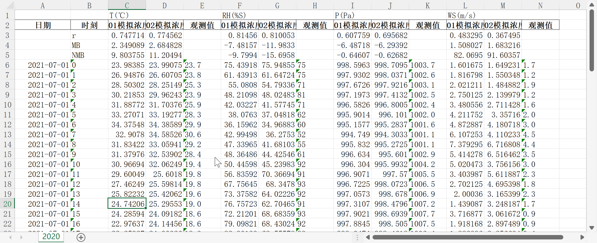

# 食用方法
## 一、安装依赖库
```
pip install pandas openpyxl numpy xlsx2csv netCDF4
```
## 二、使用
### 1.降低解析量
先将xlsx格式的原观测数据文件转化为csv格式文件,降低数据量
Xlsx格式有好多样式导致文件体积增大,不利于解析,解析单个xlsx文件时常测试需要5分钟多

命令如下:（**注意程序在windows上开发，所以当前路径下的文件需要加符号 .\   linux环境自行去除**）
```
xlsx2csv -a .\观测数据.xlsx 观测数据
```
> 解释: -a 代表导出全部sheet页  到一个叫"观测数据"的文件夹


### 2.解析和计算

将模拟数据格式为nc的文件和python脚本放到这个文件夹

输入命令
```
python .\eva.py -s .\sim_data.nc -b .\2021.csv -o .\2021_out.xlsx
```
> 解释: -s 后跟模拟数据文件 -b 后跟观测数据文件-o 自定义的输出文件名


